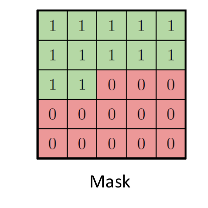
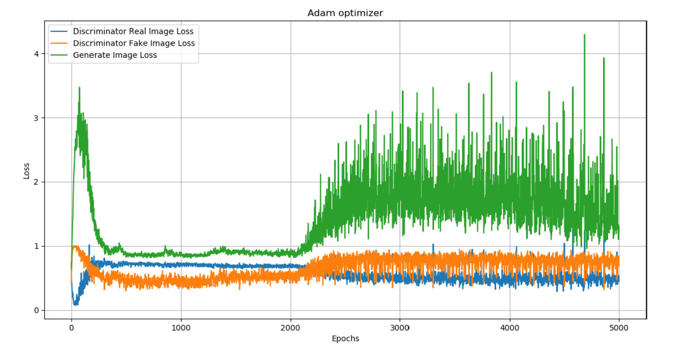
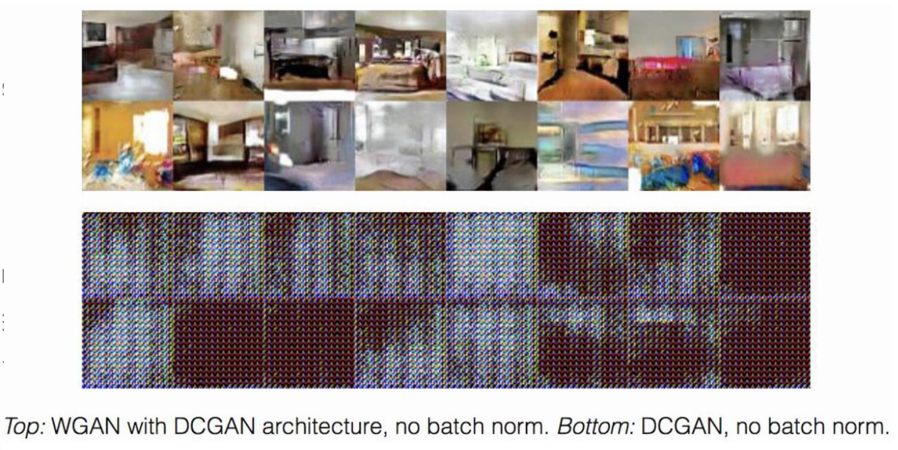
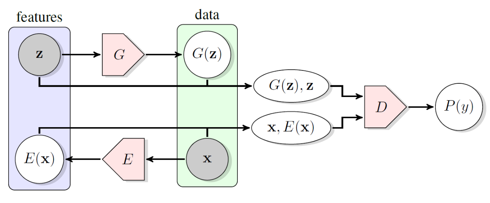
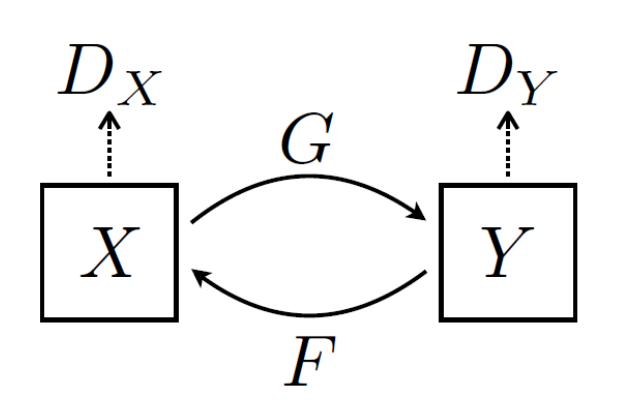

# 2. Generative Models

## 2.0 Introduction

还记得我们在Introduction里下的并不严谨的定义吗？

> 我们希望找到 $NN$ ,使得给定 $y$ ,我们可以生成一个 $NN(y) = x$ , 使得 $x \in X_0$ , 并且 $f(x) = y$ .

首先的一个问题就是， $y$ 很少但 $x$ 很多，而我们希望的肯定不是对于每个 $y$ 都输出固定的图片,所以我们想要的 $NN$ 并不是一个数学上的映射！那它究竟是什么呢？由于我们想对 $y$ 输出不同的 $x$ ，于是我们容易想到两种方法：一种是 $NN$ 本身就是一个随机函数，对于固定的 $y$ ,有可能输出很多种不同的 $x$ ; 另一种则是给 $NN$ 增加一个随机参数 $z$ , 使得 $NN(y,z)$ 是一个映射，并且希望 $f(NN(y,z)) = y$ . 对于前者，我们介绍Energy-based Model,对于后者，我们介绍VAE，flow model和GAN. 事实上，我们在训练模型的时候发现，对于不同的 $z$ 的分量，当我们连续变化的时候，可以注意到 $z$ 的这个分量有时就代表着图片的某个human readable的特征，所以 $z$ 也被称为latent variable.

## 2.1 Loss Function: MLE Training

那么，我们应该怎么定义一个损失函数？看上去我们还没有想法，因为我们甚至没有定义清楚问题！我们在开头说的不能每种label记住一张图片的问题一定要在我们的损失函数中体现出来，以及如何刻画 $X_0$ 中的图片也是一个问题。我们先从后者切入，既然我们现在已经有了一个概率模型，并且 $P$ 中的图片确定在 $X_0$ 中（我们在接下来讨论中先不考虑标签），那我们不妨优化 $P$ 中图片的概率，然后希望它有好的泛化能力，然而， $\sum_{x\in P}p(x)$
并不是一个好的优化目标，因为它不仅有之前每种label记住一张图片就可以优化到1的问题，它的量级也非常小（想像整个图片的可能性有多大！），从而几乎难以训练。

所以，一个好的损失函数至少应该满足三个性质：

- 1.要能体现训练集上的图片的“好”( $P\subset X_0$ )；
- 2.不能是特别小的量(不能和 $p$ 同等量级)；
- 3.不能有trivial的极值使得模型只关注数据集中的少数图片

于是，这就引出了一个非常聪明的损失函数估计MLE(Maximum Likelihood Estimation):

$$
L=\frac{1}{|P|}\sum_{x\in P}\log p(x)
$$

我们要对 $L$ 做梯度上升使之最大化（或者如果不习惯梯度上升，也可以对 $-L$ 梯度下降）。我们可以发现看到这个函数通过增加一个log函数，非常巧妙地在保留性质1的同时完美地解决了性质2和3的问题，此时 $L$ 的理论最大值在 $p(x)$ 在 $P$ 里每处都取 $\frac{1}{|P|}$ 时取到，并且一但某个图片被忽略，概率极小，那么整个 $L$ 会受到很大影响。

接下来，我们将介绍几种模型架构，并且使用MLE的损失函数来训练。

### 2.1.1. Energy-based Model

既然我们的模型就是一个概率分布 $p(x)$ , 那么最简单粗暴的方法当然就是直接对每个 $x$ 用某个函数来表示他的概率，同样为了让相对大小在正常的量级上方便计算(同时也受物理学方面的一些启发，以及早期的一些network结构的研究)，我们考虑去对于每个 $x$ 定义一个能量函数 $E(x)$ 正比于 $-\log p(x)$ ，这唯一确定了概率分布 $p(x)=\frac{1}{Z}e^{-E(x)}$ ，其中 $Z$ 是归一化因子。

#### 2.1.1.1 Hopfield Network:Intro

一个简单的典型例子是Hopfield Network,它的输出是 $\{-1,1\}^n$ 中的向量，而能量函数被定义为 $E(x)=-\frac{1}{2}x^TWx$ ，其中 $W$ 是一个对称矩阵，也是我们需要训练的参数。

（值得一提的是，事实上，Hopfield Network最初并不是一个概率生成模型，而是一个用来store pattern的确定的能量模型，注意到如果让 $w=xx^T$ ,那么就可以知道 $x$ 的能量唯一最小，对于一般的多个 $x$ ,我们也希望通过构造适当的 $W$ 让 $x$ 们是能量极小点，从而通过在网络中梯度下降寻找极小值来找到储存的 $x$ .然而，有论文证明了， $N$ 个点的Hopfield Network 最多储存 $O(N \log N)$
个pattern, 并且这个上界是否可以改进还并不知道，这也从某种角度上说明了前面我们所担心model 会记住数据集的“过拟合”的问题并没有那么严重。）

基于hopfield network的概率生成模型被称为Boltzmann Machine. 虽然能量看上去定义简单，可是稍微想一想就会发现两个问题：因为我们要进行梯度下降，所以计算梯度的过程中肯定要用到归一化系数 $Z$ ,可是 $Z$ 根本算不出来！(事实上，对这种最简单的network,有一些数学上方法可以算出 $Z$ ，可是一旦网络稍微复杂一点， $Z$ 的计算就会毫无想法，想象 $E(x)$ 是一个神经网络的情形！) 更致命的是，即使我们得到了一个好的模型参数 $W$ ，我们怎么生成图片?我们能得到的只是给定一个图片的概率（其实甚至概率都不是，因为还没有归一化）

这两个问题对一般的energy-based model并没有通用的解决方案，事实上，这也是energy-based model最大的问题之一。接下来我们针对Hopfield Network, 给出一个解决方案，这个解决方案也可以适用到一类比较好的 $E(x)$ 的energy-based model上。

#### 2.1.1.2 Hopfield Network: Solving the problem

我们先写一下一般的energy-based model的损失函数：

$$
L=\frac{1}{|P|}\sum_{x\in P}\log \frac{e^{-E(x)}}{Z}=\frac{1}{|P|}\sum_{x\in P}(-E(x)-\log Z)
$$

从而

$$
\nabla L = \frac{1}{|P|}[\sum_{x\in P}-\nabla E(x)]-\frac{\nabla Z}{Z}
$$

我们发现前面半段是容易的，直接用SGD就可以计算，但真正恶心的是后面的 $\frac{\nabla Z}{Z}$ 项，因为 $Z$ 根本算不出来！更不用说梯度了。那么我们怎么办呢？这个时候就体现出我们定义的这个概率函数的好处了，我们可以来进行一些简单的计算。

$$
Z= \sum_{x}e^{-E(x)}=\sum_{x}e^{\frac{1}{2}x^TWx}
$$

$$
\nabla_W Z = \sum_{x}e^{\frac{1}{2}x^TWx}\nabla_W(\frac{1}{2}x^TWx)=\sum_{x}e^{\frac{1}{2}x^TWx}\frac{1}{2}x^Tx
$$

所以

$$
\frac{\nabla_W Z}{Z} = \frac{\sum_{x}e^{\frac{1}{2}x^TWx}\frac{1}{2}x^Tx}{\sum_{x}e^{\frac{1}{2}x^TWx}}=\frac{\sum_{x}e^{\frac{1}{2}x^TWx}\frac{1}{2}x^Tx}{Z}
$$

$$
=\frac{1}{2}\sum_{x}\frac{e^{\frac{1}{2}x^TWx}}{Z}x^Tx
$$

我们发现一个神奇的事情， $\frac{e^{\frac{1}{2}x^TWx}}{Z}$ 正是我们取到 $x$ 的概率!所以实际上这个式子就是我们在计算 $E_{x \in D}x^Tx$ ，其中 $D$ 是我们的概率模型所代表的概率分布。这样，我们就可以通过采样来估计这个值，从而计算梯度。

总结一下，

$$
\nabla_{W}(L)=\frac{1}{|P|}(\sum_{x\in P}x^Tx)-E_{x \in D}x^Tx
$$

其中 $D$ 是当前的概率模型所代表的概率分布。（我们在下文中也采取这个记号表示当前模型所对应的概率分布）你可能会注意到我们丢掉了系数 $\frac{1}{2}$ ,这是因为我们之前假设 $W$ 是一个对陈矩阵，所以每个分量的梯度实际上被计算了两次，当 $W$ 不是对陈矩阵的时候，我们就需要加上这个系数。不过一般来说，这个系数并不重要，因为我们的目的是让梯度下降，而这个系数只是一个缩放。

前面一项可以直接计算（在SGD中就是对取出的batch计算），而后面的一项可以通过采样来估计，于是我们就完成了整个过程...吗？并没有！因为我们始终还没有解决一个重要的问题：如何从 $D$ 里面采样！

接下来，我们将介绍一系列sampling的方法，用来解决sampling的问题。形式化地，我们现在有一个很大的集合 $X$ ,以及一个 $X$ 上的概率分布 $D$ ,但是我们可以计算的只是对于单个的 $x$ 所对应的未归一化的概率 $p(x)$ ,我们希望从 $D$ 中采样,或者计算某些函数在 $D$ 上的期望。

#### 2.1.1.3 Sampling Methods

##### 2.1.1.3.1 Gibbs Sampling

Gibbs Sampling是一种常见的采样方法，它的基本思想是，我们先随机取一个 $x=(x_1,\dots,x_n)$ ,然后以概率 $(x_i|x_1,\dots,x_{i-1},x_{i+1},\dots,x_n)$ 更新 $x_i$ 的值，重复直到收敛（in pratice, 可能会出现在某个小范围震荡不收敛的情况，这个时候我们近似认为这个小区域内每个都差不多，于是实际的过程就是重复更新足够多次然后取一个）。

这在给定(n-1)个分量后， $p(x_1,x_2,\dots,x_{i-1},x_{i+1},\dots,x_n)$ 的条件概率是一个简单的分布的时候是非常有效的，例如在Hopfield Network中，条件分布事实上就是一个两点分布(别忘了我们的定义 $x_i\in\{-1,1\}$ ),然而，对于一般的条件概率不好算的连续分布，我们还需要更多的方法来计算。

##### 2.1.1.3.2 Importance Sampling

Importance Sampling 用来解决计算在某个分布下估计函数期望的问题，具体地，如果我们要估计 $E_{x \sim p}f(x)$ , 但从 $p$
中采样及其困难，因为我们只有未归一化的概率而没有归一化系数。那么，我们可以找一个简单，好采样的分布 $q$ , 然后估计 $E_{x \sim q}f(x)\frac{p(x)}{q(x)}$ ，这两个期望在数学上是相等的，然而通过“换元”我们得到了一个更好采样的分布。

我们可以用一个例子来理解Importance Sampling: 假如面前有 $N$ 箱不同的水果，每箱水果的种类和个数都不一样（单个箱子里的水果重量都是一样的），我们想通过采样来算出单个水果的平均重量。(重量代表 $f$ ,每箱水果代表一个 $x$ ,个数代表未归一化的 $p$ )

一个自然的想法是随机取若干个水果取平均，然而，由于箱子数太多，我们根本不能全打开，从而我们不知道水果的总个数，于是无法真正“均匀随机”取出水果！于是自然的想法就是我们均匀随机取1~N对应的箱子，对这些箱子中所有水果的重量取平均，这样我们就得到了一个估计值。这个估计值的期望就是我们想要的平均重量，这对应的是 $q$ 是uniform的情况。 $q$ 非uniform 的情况的intuition是，假如我们知道1~10号箱子里的水果特别多，占了总数的90%，然而在1~N的均匀随机取样中却有可能根本取不到这些箱子，导致估计值严重缺乏真实性。

于是，我们可以将这些箱子 $x$ 每个都拆成 $q(x)$ 个小“箱子”，这样就可以使取到的概率提升，但每箱中水果的个数就变成了 $\frac{p(x)}{q(x)}$ 个，这就对应了我们的公式。

从这个例子里可以看出，因为我们最理想的情况其实是均匀随机取出一个水果采样，所以最优策略是要让每个小箱子里水果数都一样，也就是 $p$ 和 $q$ 尽可能接近。从数学上可以证明，当它们正比时，估计值的方差最小。

##### 2.1.1.3.3 Metropolis-Hastings Algorithm

Metropolis-Hastings Algorithm 是Gibbs Sampling 的推广。想象我们在Gibbs Sampling的时候，相当于构造了一个随机过程，然后希望这个随机过程最终收敛到我们的概率分布。那么，我们是否可以构造一个更一般的随机过程，使得它最终收敛到我们的概率分布呢？这就是Metropolis-Hastings Algorithm的思想。

具体地，我们先任意构造一个proposal distribution $q(x'|x)$ , 希望表示在随机过程中 $x'$ 转移到 $x$ 的概率（密度），然而随便构造 $q$ 显然不能让这个随机过程的稳定分布是我们想要的概率分布，于是我们引入一个接受概率 $A(x\rightarrow x')$ ，这个概率表示在 $x$ 的情况下，我们接受 $x'$ 的概率，具体地，我们有

$$
A(x\rightarrow x')=\min\{1,\frac{p(x')q(x|x')}{p(x)q(x'|x)}\}
$$

最终，我们的随机过程定义为：对当前的 $x$ ,在 $q(x'|x)$ 下采样一个 $x'$ ,然后以概率 $A(x\rightarrow x')$ 接受 $x'$ ,否则保持 $x$ ，重复这个过程直到收敛。可以证明，在 $p$ 满足一些连续性条件的情况下，这个随机过程的稳定分布是我们的概率分布。

#### 2.1.1.4 Boltzmann Machine

现在我们有了采样方法，终于可以来训练基于Hopfield Network的Boltzmann Machine了！ 具体的训练过程如下

- 1.初始化 $W$
- 2.使用Gibbs Sampling采样，从而估计梯度，做梯度下降

$$
\nabla_W L = \frac{1}{|P|}(\sum_{x\in P}x^Tx)-E_{x \in D}x^Tx
$$

- 3.重复2直到收敛

在实际应用中，为了提高模型的表现力，我们可以让 $x$ 的维度实际上大于需要的图片的维度，只让 $x$ 的前面的维度代表生成的值，而剩余的维度被称为Hidden Neurons,通过增加Hidden Neurons的数量，我们可以大大增加模型的表现力。

加上了Hidden Neurons的Boltzmann Machine已经可以解决黑白图片去噪和补全的任务了，并且效果还比较令人满意。


然而，这样的Boltzmann Machine还有一个很大的问题，计算开销实在是太大了！我们每一次梯度下降的时候都需要进行采样，而采样是一个非常多步骤的Gibbs Sampling,更加致命的是还无法并行！于是，Paul Smolensky提出了Restricted Boltzmann Machine的想法， 并被Hinton实验成功。

具体的说，我们让最终矩阵是一个 $2\times 2$ 分块的矩阵，并且有两块是 $O$ ,也就是说，Visible Neurons两两之间的乘积的系数以及Hidden Neurons 两两之间乘积的系数都是0.
这样，我们发现可以对所有Hidden Neurons(Visible Neurons)并行地做Gibbs Sampling! 从而，我们更新一轮需要做Gibbs Sampling的次数从节点个数次直接下降到了2次，极大提高了效率。


### 2.1.2 Normalizing Flow

#### 2.1.2.1 Intro

Energy-based model非常灵活，并且理论上来说每个概率分布都可以对应一个energy-based model，所以事实上所有模型都可以理解成energy-based model. 但是最大的缺点就是实在太麻烦了！即使在使用很多优化的情况下，还是非常麻烦，因为始终避免不了取样！那么能不能简单一点呢？首先是随机性问题，那我们就直接开始给定一个随机的变量 $z$ ,然后训练一个确定的网络从 $z$ 生成 $x$ ,那 $x$ 不也有随机性了吗？这样的 $z$ 被称为隐变量(latent variable)，因为在实验中，人们发现它的一些维度恰好代表了某些human readable的特征，比如颜色，大小等等。这样一来，我们的生成就不需要从整个概率分布里采样（我们也不知道整个概率分布的密度函数），而是直接随机采样一个 $z$ ,然后生成 $x$ 就行了！

#### 2.1.2.2 Structure

为了生成 $x$ , 我们采用一系列变换层 $f_1$ , $f_2$ ,..., $f_k$ ,最终 $x=f_k\circ f_{k-1}\circ \dots \circ f_1(z)$ 。于是，采样的复杂问题直接解决了，但训练的时候仍然有一些问题。微积分的知识告诉我们，如果 $f_i$ 都是可逆函数的话，那么 $p(x)$ 就是 $p(z)$ 再乘上 $f_i$ 的雅可比行列式的乘积，这里 $z=NN^{-1}(x)$ 但Jacobi行列式需要 $O(d^3)$ 的复杂度!(其中 $d$ 是向量的维度)这么大的计算量是不可接受的。所以，flow model 最重要的目标就在于找到Jacobi行列式好算的，同时表现力又比较强的函数 $f$ .

#### 2.1.2.3 Planar Flow

Planar Flow 的想法来源于数学上的Matrix Determinant Lemma:

$$
\det(A+uv^T)=(1+v^TA^{-1}u)\det A
$$

从而，如果我们构造

$$
f(z)=z+u\cdot tanh(w^Tz+b)
$$

（其中 $u,w,b$ 是参数， $\cdot$ 代表分量对应相乘）
这样，我们可以发现

$$
\det(\frac{\partial f}{\partial z})=\det(I+h'(w^Tz+b)uw^T)
$$

 

$$
=1+h'(w^Tz+b)u^Tw
$$

从而我们可以在 $O(d)$ 的时间里计算出Jacobi行列式！

#### 2.1.2.4 RealNVP

planar flow的想法固然高级，可是函数似乎只是对着lemma凑出来的，为了让Jacobi行列式计算简单，真的要这么复杂吗？事实上并不用！我们发现有一类行列式计算非常简单：三角矩阵的行列式！而Jacobi矩阵是三角矩阵的条件其实就是 $f(x)$ 的第 $i$ 个分量只依赖于 $x_1,x_2,\dots,x_i$ ,但这个限制实际上并不会很强！并且我们可以在不同的 $f$ 之间对 $x$ 进行重排，这样大大增加了模型的表达能力。由此，便引出了RealNVP的结构：

$$
f:x \to z
$$

$$
z_{1:m} = x_{1:m}
$$

$$
z_{m+1:d}=x_{m+1:d}\cdot e^{\alpha(x_{1:m})}+\mu(x_{1:m})
$$

其中 $\alpha,\mu$ 是待训练的神经网络。

下图右侧是RealNVP的生成结果，可以看到已经达到了很高的水平


同时，通过对 $z$ 的插值，先取定四个值 $z^0,z^1,z^2,z^3$ ，然后让 $z=cos \alpha (cos \beta z^0 + sin \beta z^1)+ sin \alpha (cos \beta z^2 + sin \beta z^3)$ ,可以观察到图片的特征连续变化的过程。


#### 2.1.2.5 Autoregressive Flow

在说Autogegressive flow之前，我们先说一下Autoregressive(自回归)的概念，它是一个数学上的概念，表示用 $x_1,x_2,...x_{i-1}$ 来预测 $x_i$ (和之前的区别是用自己预测自己！之前是 $z_1,z_2,...,z_{i}$ 获得 $x_i$ ).也就是说，我们是不是可以 $f(x)$ 的第 $i$ 个分量不仅仅依赖于 $z$ ,而是也依赖于前面的分量？

从而，我们可以定义Autoregressive Flow的结构:

$$
f:x \to z
$$

$$
x_i = e^{\alpha_i}z_i+\mu_i
$$

$$
\alpha_i =\alpha(x_1,x_2,...,x_{i-1})
$$

$$
\mu_i = \mu(x_1,x_2,...,x_{i-1})
$$

其中 $\alpha,\mu$ 是神经网络


在这里，你可能会注意到一个问题，在不同的计算过程中 $\alpha$ 和 $\mu$ 接受的参数个数不一样！如何解决这个问题呢？其实很简单，我们直接让它们接受的参数个数就是维度 $d$ ,然后把第 $i$ 维之后的全部设成0就行了，这个过程称为mask.具体实现就是让输入逐分量乘上一个 $mask=(1,\dots,1,0,\dots,0)$ .

#### 2.1.2.6 PixelCNN

PixelCNN是一个特殊的Autoregressive Flow，它把卷积和Autoregressive的生成结合起来。但和之前的Autoregressive Flow不同的是，我们干脆**不要$z$，直接通过$x$进行生成**。具体来说，模型输入一个每个分量都是quantized（比如，每个像素都是0或1）的图片，而autoregressive地预测每个分量是0或者1的概率（即**每个Pixel的输出结果由前面的所有pixel值决定**）。

可以参考下面的伪代码来理解训练的过程：
```python
def train_epoch():
    for images,_ in train_loader:
        # convert an image to 0, 1
        images = (images > 0.33).float() 
        # the model outputs the probability of each pixel being 0 or 1
        logits = model(images) 
        # for pixels that is really 0, the probability of being 0 should be high, and vice versa
        loss = F.binary_cross_entropy_with_logits(logits, images) 
```

而生成的过程可以如下地展示：
```python

def generate_image():
    pixels = torch.zeros(N, C, H, W)  # Initialize pixels as zeros
    with torch.no_grad():
        # Iterate over the pixels because generation has to be done autoregressively
        for c in range(C):
            for h in range(H):
                for w in range(W):
                    # Feed the whole array and retrieving the pixel value probabilities for the next pixel.
                    logit = model(pixels)[:, c, h, w]
                    prob = logit.sigmoid()
                    # Use the probabilities to pick the pixel value and append the value to the image frame.
                    pixels[:, c, h, w] = torch.bernoulli(prob)
```

但一个处理图片的卷积网络应该如何保证Autoregressive性质呢？一个重要的想法就是 **masked convolution**。我们直接把卷积核mask掉后一半：



也就是说, $x_{ij}$ 实际上依赖于 $x_{uv}(|u-i|\le d,|v-j|\le d)$ 且 $x_{uv}在x_{ij}$ 前面的那些 $x$。 

但这只是一个intuition，在实际应用中我们要考虑很多细节上的问题。

第一个问题在于，如果我们只是简单地这样做，多层迭代之后所有像素都会变成0！下面的插图展示了这一点：黄色部分代表着center pixel（红色）的receptive field（即使用上面的mask迭代若干次后，哪些pixel能影响这个center pixel）。可以发现，卷积很多次之后，黄色部分不断向左上角移动，可以料到它会逐渐移出图片非零的范围。


为了解决这个问题，我们引入**两类不同的mask**：A类和B类。上面展示的就是A类mask，而B类mask则是将正中心的0设置为1。在多层卷积时，只有第一层使用A类，其余都使用B类。可以发现，这样经过多层以后，receptive field并不会不断整体向左上移动。


但你看着这个图，就立刻会发现第二个问题：即使经过足够多层这样的操作， $x_{i,j}$ 获得的信息也并不是初始的所有在 $x_{i,j}$ 之前的像素的信息，而是会有视野盲区（这被称为tooth-shaped receptive field）。虽然这并不会有特别大的影响，而也可以采用某些修正（你能想到吗？）避免这个问题，这被称为**Gated Pixel CNN**。具体的实现可以参考[原始论文](https://arxiv.org/abs/1606.05328)。


#### 2.1.2.7 AF v.s. IAF

回到上面关于AF的讨论，我们发现，当 $x\to z$ 的时候，所有的 $\alpha,\mu$ 可以并行计算，从而训练的速度很快，然而在从 $z$ 生成 $x$ 的时候因为有相关性，无法并行计算，只能一个一个元素计算，导致生成的速度会比较慢。

与之相对应的是IAF，其思路也很简单：既然 $x\to z$ 是双射，那我把 $x$ 当成隐变量， $z$ 当成生成结果不就行了？或者如果你觉得不能理解的话，也可以把原来的 $\alpha,\mu$ 接受的参数改成 $z$ 的对应分量而非 $x$ . 这样生成速度就可以得到很大的提升，但是训练速度就会变慢。


有了AF和IAF，一个很自然的问题就是，我们能不能结合它们，让生成和训练的速度都很快？这就引出了一个著名的工作：Parallel WaveNet.

这个工作的想法是这样的，首先我们可以训练出来一个AF，它的训练很快，但是生成很慢。我们希望有一个IAF，但是IAF训练太耗时间了，那么我们能不能通过已经训练好的AF加速IAF的训练？

我们发现IAF训练慢的原因就在于给定 $x$ 算 $z$ 无法并行，但是我们的 $AF$ 刚好可以做到这一点！那么为何不让我们搞好的 $AF$ 帮它算 $z$ 呢？但其实这没有任何道理，因为两个模型的定义和过程都不一样，所以我们希望训练出来的IAF实际上和我们的AF就是一样的，然后就可以让AF帮他算了！也就是说我们IAF的目标并不是之前的MSE估计了，而是和这个AF的接近程度！

于是，我们的训练过程如下：

- 训练一个AF 模型，被称为teacher
- 训练一个IAF 模型，称为student,损失函数定义为和AF 模型输出的差距(KL divergence)，而 $x \to z$ 的部分让teacher帮他算，从而加速
- 最后使用这个IAF模型，从而可以快速生成

### 2.1.3 Variational Autoencoder

#### 2.1.3.1 Intro

在flow model里，我们相当于定义了 $z$ 到生成的图片的一个映射，而可否简单一点，直接定义 $p(x|z)$ ?这就是VAE的思想。在这之前，我们先来generally计算一下MLE损失。

#### 2.1.3.2 Design the structure

我们仍然采取和之前一样的的MLE估计，此时，

$$
L=\frac{1}{|P|}\sum_{x\in P}\log(\sum_z p(x,z))
$$

简单起见，我们考虑求和中的一项 $\log(\sum_z p(x,z))$ ,
由于这个式子本身就不好计算，梯度更加难算，我们用1.3.1中的Importance Sampling来估计这个值，具体地，我们引入一个分布 $q(z)$ ,然后我们可以估计这个值为

$$
\log p(x)=\log \sum_z q(z)\cdot \frac{p(x,z)}{q(z)}
$$

$$
\ge^{Jensen}\sum_z  q(z)\log \frac{p(x,z)}{q(z)}
$$

我们称右侧的这个下界为ELBO(Evidence Lower Bound)。
从而，我们可以通过从 $q$ 中sample来估计后者从而估计前者。同时，为了让前后尽可能接近，我们训练 $q$ 使得两者误差最小。注意到右侧事实上是

$$
ELBO=\sum_z q(z)\log \frac{p(z|x)p(x)}{q(z)}=\log p(x)-KL(q(z)||p(z|x))
$$

所以，在主训练步骤中，我们想要让 $\log p(x)$ 尽量小，从而达到更好的效果，在训练 $q$ 的过程中，我们想让它和 $p$ 尽量接近，从而让取样模拟真实情况，方差更小。这时候再看上面那个式子，我们惊奇地发现，事实上这两件事都是在让ELBO最大化！所以，我们的两个过程都可以用一个统一的损失函数ELBO来训练。（你可能会注意到，这里虽然一切都吻合地非常好，但是也都是intuition,没有特别的必然性，所以其中的步骤仍然有调整的空间， $\beta-VAE$ 就是修改我们的ELBO，在KL散度前面加系数，使之取得更加灵活的效果）

**所以，我们的损失函数可以定义为上面的ELBO!**

至此，我们已经做出了一个比较完整的分析，在进入训练步骤之前，我们还需要考虑一个小小的改动。前面为了偷懒，我们只考虑了一个 $x$ 的情形，然而，我们不能对每个 $x$ 训练一个单独的 $q$ ,于是我们转而考虑训练一个神经网络 $q(z|x)$ . 于是，我们的总体目标变成了训练两个神经网络 $q_{\phi}$ 和 $p_{\theta}$ ,使得

$$
ELBO=\frac{1}{|P|}\sum_{x\in P}\sum_z q(z|x)\log\frac{p(z,x)}{q(z|x)}
$$

$$
=\frac{1}{|P|}\sum_{x\in P}\sum_z q(z|x)\log\frac{p(x|z)p(z)}{q(z|x)}
$$

$$
=E_{x\sim Uni(P)}[E_{z\sim q(z|x)}[\log p(x|z)]-KL(q(z|x)||p(z))]
$$

经过上面的数学变形，我们发现，这个loss有了直观的意义：第一项称为reconstruction loss, $q$ 就像一个编码器，把图片 $x$ 编码成特征 $z$ ，而 $p$ 则想以最大概率恢复原来的图片，第二项称为KL散度，它想让 $q$ 和 $p$ 尽量接近，从而让 $q$ 的取样和真实情况更接近。

总结：
我们通过importance sampling的下界，找到了一个关键的损失函数 $ELBO=\sum_z q(z|x)\log \frac{p(z,x)}{q(z|x)}$ ,它有两种表示

$$
ELBO=\log p(x)-KL(q(z|x)||p(z|x))
$$

$$
ELBO=E_{x\sim Uni(P)}[E_{z\sim q(z|x)}[\log p(x|z)]-KL(q(z|x)||p(z))]
$$

第一种表示说明它在生成模型的训练和proposal的训练中都起到了evaluation的作用，所以可以作为统一的损失函数，而第二种表示则给出了直观的意义，同时变为了方便采样计算的结构。

#### 2.1.3.3 choose of $q$ and $p$

为了计算方便，我们取

$$
p_{\theta}(z)=N(0,I)
$$

$$
p_{\theta}(x|z)=N(f_{\theta}(z),I)
$$

$$
q_{\phi}(z|x)=N(\mu_{\phi}(x),diag(\exp(\sigma_{\phi}(x))))
$$

其中 $f_{\theta},\mu_{\phi},\sigma_{\phi}$ 都是神经网络。也许你会奇怪，这里的 $p_{\theta}(z)$ 就是标准高斯分布是不是有点太随意了？实际上并不是这样——我们的latent variable究竟代表什么并没有一个明确的规定，而我们怎样定义模型实际上决定了最后我们学到怎样的latent variable。当然，标准高斯分布也带来了模型的一定限制，我们在后面会提到，但现在就让我们接受这个方法（实际上，它也非常地有效）。

#### 2.1.3.4 Training

回到 $ELBO$ 的可采样形式

$$
ELBO=E_{z\sim q_{\phi}(z|x)}[\log p_{\theta}(x|z)]-KL(q_{\phi}(z|x)||p_{\theta}(z))
$$

我们注意到第二项就是两个高斯分布的KL散度，可以直接计算，而第一项则是一个期望，我们可以通过采样来估计。
具体地，当计算第一项对 $\theta$ 的梯度的时候，可以从 $q_{\phi}(z|x)$ 中采样若干个 $z$ ，计算梯度平均值。而计算对 $\phi$ 的梯度的时候，由于“采样”无法求导，我们可以通过一个小技巧，即把 $N(a,b)$ 看成 $a+b\cdot N(0,1)$ , 这样我们的采样只涉及从标准正态分布中采样，从而总函数可以对 $\phi$ 求导。一般来说，由于数据的随机性已经足够强，我们只进行一次采样估计。

综上所述，总训练过程如下：

- 1.初始化
- 2.训练
  - 2.1 训练 $\theta$
    - 2.1.1 从 $q_{\phi}(z|x)$ 中采样 $z$
    - 2.1.2 通过采样估计 $\nabla_{\theta}ELBO$
    - 2.1.3 更新 $\theta$
  - 2.2 训练 $\phi$
    - 2.2.1 从N(0,I)中采样 $\epsilon$ ,根据它生成 $z$
    - 2.2.2 估计 $\nabla_{\phi}ELBO$
    - 2.2.3 更新 $\phi$
- 3.生成
  - 3.1 从 $p$ 中采样 $z$
  - 3.2 从 $p_{\theta}(x|z)$ 中采样 $x$

#### 2.1.3.5 Others

##### 2.1.3.5.1 impainting

为了图片补全，我们需要 $x\to z$ 的过程尽量robust, 这样我们就可以用需要补全的图片生成 $z$ ，然后用 $p_{\theta}(x|z)$ 生成图片。此时，我们可以在训练过程中随机mask掉一些neurons，从而让模型学会robust的特征。

##### 2.1.3.5.2 $\beta$ -VAE

就是在上面已经说明的，通过在KL散度前面加一个系数 $\beta$ ，从而可以调整reconstruction loss和KL散度的权重，从而可以调整模型的表现。

##### 2.1.3.5.3 Conditioned VAE

当数据有标签的时候应该如何处理？
此时， $p$ 变为 $p_{\theta}(x|y,z)$ ,
$q$ 变为 $q_{\phi}(y,z|x)$

对有标签的数据，我们只需要在loss中加入一项cross-entropy loss between $q(y|x)$ 和 $y$ 即可

对无标签的数据，我们让KL penalty 变成 $KL(q(z)||p(z))+KL(q(y)||p(y))$ , 对于 $p(y)$ 我们可以取一个uniform distribution. 而 reconstruction loss 则变成 $E_{z,y\sim q(z,y)}[\log p(x|z,y)]$ 但此时 $y$ 会变得难以sample从而不好计算梯度，当种类比较少的时候可以通过每一类枚举来计算，而种类比较多的时候我们将要使用一些特别的办法来处理.(~~我也不会~~)

## 2.2 Generative Adversarial Network (GAN)

### 2.2.1 Intro

至此，我们介绍了这么多生成模型，而每一种都需要做一些优化和限制，使得计算方便，而这一切痛苦的根源就在于我们在开始提出的似乎很完美的损失函数MLE.但我们有没有别的选择？回到我们原来的问题：

> 我们希望找到 $NN$ ,使得给定 $y$ ,我们可以生成一个 $NN(y) = x$ , 使得 $x \in X_0$ , 并且 $f(x) = y$ .

在没有标签的时候，我们的目标实际上是：

> 我们希望找到 $NN$ ,使得可以生成一个 $x$ , 使得 $x \in X_0$ .

然而，我们有的只是一个已知的 $X_0$ 的子集 $P$ ,而关于 $X_0$ 我们也只能知道这么多了！(以及一些平移不变等简单特征),我们发现这事实上很像神经网络干的事情！所以事实上，我们可以让一个神经网络学习 $P$ 的特征，然后用它来评估！这就是GAN的思想。

简单地说，我们同时训练两个神经网络，一个生成器 $G$ 和一个判别器 $D$ ,其中 $G$ **的目标是从一个随机的Latent variable $z$ 生成一个** $x$ **,使得** $D$ **无法判断它是不是真实的，而** $D$ **的目标是尽可能准确地判断** $x$ **是不是真实的**。对于这样最基本的GAN，我们的目标就是

$$
\min_\theta\max_\phi E_{x\sim p_{\text{data}}}[\log D(x;\phi)]+E_{\hat{x}\sim G}[\log (1-D(\hat{x};\phi))].
$$

可以看到，第一项代表着真的数据被判断为真的概率尽量大，而第二项代表Generator的生成图片被判断为假的概率，因此G希望这一项尽量小，而D希望这一项尽量大。

GAN的训练过程也很容易，只需要按照上面objective的定义进行优化即可：实际上，一般在每一个epoch训练一次Discriminator，再训练一次Generator，不断重复。

看起来这已经结束了，实际上2014年GAN的Paper也得到了很好的成果。但我们并不满足于此，转而探讨更深的知识内容。

### 2.2.2 Math Of GAN

我们首先考虑数学上，这个objective的真正含义。首先，容易看出 $D$ 的最佳行为：对于一个 $x$ ，他对loss的贡献是

$$
p_{\text{data}}(x)\log D(x)+p_G(x)\log (1-D(x))
$$

因此，我们可以解出discriminator的最优解 $D(x)^{*}$ ：

$$
D(x)^\*=\frac{p_{\text{data}}(x)}{p_{\text{data}}(x)+p_G(x)}.
$$

我们进而可以把这个表达式代入，得到 $G$ 的优化目标：

$$
L(\theta)=E_{x\sim p_{\text{data}}}\left[\log \frac{p_{\text{data}}(x)}{p_\text{data}(x)+p_G(x)}  \right]+E_{\hat{x}\sim G}\left[\log \frac{p_G(x)}{p_\text{data}(x)+p_G(x)}  \right]
$$

这实际上恰好是数学上的所谓 **Jenson-Shannon Divergence(JSD)**：

$$
\text{JSD}(p||q):= \frac{1}{2}KL\left(p||\frac{p+q}{2}\right)+\frac{1}{2}KL\left(q||\frac{p+q}{2}\right).
$$

进而我们可以写出

$$
L(\theta)=\text{JSD}(p_{\text{data}}||p_G)-\log 4.
$$

数学上指出，JSD是一种不错的distance：它不仅对称、非负，而且它的平方根还满足三角不等式。我们因此看到，GAN在理论上可以到达全局最小值，也就是 $p_G=p_{\text{data}},p_D=\frac{1}{2}$ 。

总结一下，GAN好在哪里？首先，最关键的区别在于它不需要计算概率，从而避免了采样的困难；其次，它的loss function 是一个neural net，这听起来就比之前的MLE training 更加强大。最后，我们也看到了GAN的理论优势，它有一个理论上的最优解，而这正是我们想要的。

但是：
> There is no free lunch! 

### 2.2.3 Issues
#### 2.2.3.1 How to evaluate my GAN?
当我们失去了 $p(x)$ ，减少头疼的采样的同时也让我们失去了评估这个Generative Model的手段。那么我们如何**评估**一个GAN呢？这是一个非常困难的问题，我们来介绍一些前人的尝试。

一个想法是训练一个classifier $f(y|x)$ 。对于一张真的图片，我们会期待它在各个class上面的概率分布几乎是one-hot的，因此我们希望GAN生成的图片也是这样的；而我们还希望GAN能够生成各种类别的图片，也就是说

$$
E_{x\sim G}[f(y|x)]\approx \text{Uniform}(y).
$$

把他们结合起来，就是 **Inception Score**：我们定义

$$
\text{IS}=\exp\left(E_{x\sim G}[\text{KL}(f(y|x)||p_f(y))]\right),
$$

其中

$$
p_f(y)=E_{x\sim G}[f(y|x)].
$$

可以看到，如果GAN生成的图片乱七八糟（第一种失败），那么 $p_f(y)$ 和 $f(y|x)$ 都近似uniform，因此KL divergence很小；另一方面，如果GAN生成的图片都是一类的，那么 $p_f(y)$ 和 $f(y|x)$ 都近似one-hot，因此KL divergence也很小。

但这个简单的评估标准会给GAN一些cheating的机会：如果GAN对每一类 $y$ 都学会一张图片，可以看到 $p_f(y)$ 也会是 uniform的，而 $f(y|x)$ 也会是 one-hot的，从而得到一个很高的分数。换句话说，inception score 只能评估GAN生成的图片的真实性，而不能评估多样性（或者和 $p_{\text{data}}$ 的相似性）。

由此改进出一个新的指标： **Frechet Inception Distance(FID)**。它的思想是把生成图片和真实图片经过一个预训练的神经网络，得到一个高维的feature。随后，我们把feature看成一个高维的高斯分布，通过计算 $\mu_G,\Sigma_G,\mu_{\text{data}},\Sigma_{\text{data}}$ 来计算两个高斯分布的Wasserstein distance：

$$
\text{FID}=||\mu_G-\mu_{\text{data}}||^2+\text{tr}(\Sigma_G+\Sigma_{\text{data}}-2(\Sigma_G\Sigma_{\text{data}})^{1/2}).
$$

这个指标（越低越好）有效地估计了Generator生成图片和数据集中图片分布的相似性。实验上发现这一评分标准和人的主观评价有很好的相关性——如果给图片模糊或加噪声，那么Inception Score不怎么敏感，但是FID会很快上升。

#### 2.2.3.2 Why my GAN keeps outputing identical(../assets/images??

GAN的一个巨大问题就是Mode Collapse。有时候，GAN会只生成一张图片；此外，有时候它还可能随着训练过程在各个图片打转。这个问题的根源在于GAN的loss function。回顾之前我们指出，GAN的数学本质是优化 $p_G$ 和 $p_{\text{data}}$ 之间的JSD。还记得之前介绍inclusive KL和exclusive KL的时候我们讲到过，inclusive KL可以涵盖很多的mode，而exclusive只是会简单地靠近概率最大的mode。这里不幸的是，**JSD本身类似exclusive KL**，因此我们的GAN也只能学会几个少数的pattern。更加不幸的是

> There is no fundamental solution for mode collapsing in GAN.

#### 2.2.3.3 Why is my GAN training so instable???



如果你真的自己去训练一个GAN，那么你很大概率就会体验到GAN训练的不稳定性。很有可能，前一个epoch discriminator的准确率已经上升到百分百，下一个epoch就立刻降到0。这不是你的问题，而是GAN本身就像一个两个人竞争的game，很难达到Nash Equilibrium。举一个简单的例子：假设 $x$ 和 $y$ 两人同时优化

$$
J=-xy,
$$

$x$ 希望 $J$ 最大， $y$ 希望 $J$ 最小。一个Nash Equilibrium是 $x=y=0$ ，但是实际上并不能真的到达这个点。

这样的情况为训练带来了很大的痛苦——即使你现在看着你的模型给你吐出完美的噪声，你也不知道是否应该放弃：也许几个epoch之后情况会完全变化。换句话说，很难找到一个 stopping criterion。另外一个直接结果是，模型很可能瞬间崩溃——前一个epoch还在生成完美的数字，下一个epoch就成为了全白的噪声。

不仅如此，GAN还饱受梯度消失的折磨。直观上看，Generator 从一个 $\sim 100$ 维的hidden state生成一个 $28\times 28$ 维度以上的图片，而Discriminator只需要在 $28\times 28$ 的高维空间用一刀切开真假图片。这听起来就不公平，的确也是如此：discriminator 很容易就很快达到百分百准确率，此时generator的梯度就很快会消失。

### 2.2.4 Let's make GAN work!

#### 2.2.4.1 DCGAN (Deep Convolutional GAN)
第一个伟大的尝试是DCGAN。在这个结构里，我们只用convolutional layer，**不加任何pooling**，除了改变大小用的projection layer也**不加任何MLP layer**。特别地，我们不能用那些supervised learning中强大的结构作为Discriminator。

此外，它指出应当使用**Batch Normalization**。但是，在Generator的最后一层和Discriminator的第一层不能加入Batch Normalization，这样Generator才能学会图片像素的绝对大小，而非相对大小。它还指出一个batch 必须要么全是真的要么全是假的，这样才能保证Batch Normalization的效果。

最后，我们为了避免gradient vanishing，在discriminator中不采用ReLU，而是用**Leaky ReLU**。实验上很推荐的数值是0.2。在Generator中，ReLU是推荐的，但最后一层的激活要使用tanh。

除了网络结构，在训练方向它也给出了一系列很好的参数：lr=0.0002, Adam optimizer, batch size=128, momentum $\beta = 0.5$ .

DCGAN是一个巨大的成功，同时也揭示了很多有意思的知识。比如说，对latent space可以作加减法：

$$
G(z_1)=\text{man with glasses}\\
G(z_2)=\text{man without glasses}\\
G(z_3)=\text{woman without glasses}\\
\Longrightarrow G(z_1-z_2+z_3)=\text{woman with glasses}.
$$

#### 2.2.4.2 Improved Training Techniques for GAN
一系列GAN的训练技巧又诞生了。首先是 **Feature Matching**。为了**避免 Gradient Vanishing**，我们不只是保留最后Discriminator的输出，还要取出经过Discriminator几层卷积之后提取出的feature。随后，我们加上这样一个loss：

$$
L_{\text{feature matching}}=|E_{x\sim G}[f(x;\phi)]-E_{x\sim \text{data}}[f(x;\phi)]|^2
$$

其中 $f$ 代表discriminator从 $x$ 中提取出的 feature。这样，Generator可以获得来自数据集的统计信息。

一个重要的（一定程度上）**避免mode collapse**的办法是 **Minibatch Discrimination**。直观上看，怎么避免Generator生成相同的图片呢？我们很容易评估Generator的图片的相近程度，因此我们也可以给Discriminator加入这个功能，只要它看输入图片差不多就立刻判断成假的。具体地，我们给discriminator加入一个projection tensor $T$ ，然后对于输入 $x_i$ 卷积若干层后得到的 $f(x_i)$ 作以下操作：

$$
M_{ibc}=f(x_i)T_{ibc}\\
s(x_i,x_j)_b=\exp(-||M_{ib}-M_{jb}||_1)\\
o(x_i)_b=\sum_{j\neq i}s(x_i,x_j)_b\\
$$

（注意这里的 $b$ 可不是batch中的编号，而是引入的一个新的维度的index）然后把得到的 $o(x_i)$ 加入到原来的feature中。简单来说，这里把输入的一系列图片投影到一个空间，并在那个空间内部

**Historical Averaging**是用来**稳定训练**的一个技巧。这个思路说起来很直接——我们只需要引入一个额外的loss

$$
\left|\theta-\frac{1}{T}\sum_{t=1}^T\theta_t\right|^2
$$

即可。

**One-sided Label Smoothing**也是用来**避免 Gradient Vanishing**的一个技巧。直观上看，我们希望Discriminator不要太自信。换句话说，原来的

$$
\text{CrossEntropy}(D(x),1)+\text{CrossEntropy}(D(G(z)),0)
$$

变成了

$$
\text{CrossEntropy}(D(x),0.9)+\text{CrossEntropy}(D(G(z)),0).
$$

这样，Discriminator即使是对于真实的图片，也最多有90%的确信程度。这就给Generator带来了一线机会。我们也可以理解为什么不能把第二项设成0.1：否则Generator可能会生成随机的噪声图片，还不受到太多惩罚。

**Virtual Batch Normalization**处理的问题是，前面引入的Batch Norm导致一个batch中的图片之间的关系太强（比如说，实验上看到它们都是一个色调）。解决的办法是，我们引入一个虚拟的batch，然后用这个虚拟的batch来给出统计数据计算Batch Norm。这样，我们就可以避免同一个batch中图片的依赖性。当然具体实践中采用的写法也和这里简单的介绍并不完全相同。

#### 2.2.4.3 And more techniques...
GAN的训练技巧还有很多，大部分都可以在网上搜索找到。但是注意具体情况具体分析——很多别人认为至关重要的技巧很可能在你的超参选取或者模型结构的基础上几乎没有任何效果。不过无论如何……
> "Keep calm and train a GAN"

### 2.2.5 WGAN: How about improving GAN from its root?

#### 2.2.5.1 Changing the loss

我们还记得之前指出，GAN的训练等价于优化JSD。但是JSD本身具有许多问题。比如说之前提到的mode collapse。不仅如此，它还会造成Gradient Vanishing。我们可以发现，如果 $p_{\text{data}}$ 和 $p_G$ disjoint，那么

$$
\text{JSD}(p_{\text{data}}||p_G)=\log 2.
$$

是一个常数。这有点违背我们对divergence的直觉——作为一种“距离”，即使是两个分布disjoint，也应该大概能反映一些它们之间差距的信息，而不是应该是常数。一个数学上的可行候选人是 **Wasserstein Distance**：

$$
W(P,Q)=\inf_{\gamma\in \Pi(P,Q)}E_{(x,y)\sim \gamma}[||x-y||]
$$

其中 $\Pi(P,Q)$ 代表 $\gamma$ 从所有的二元分布中选取，并且必须满足

$$
\int \gamma(x,y)dx=q(y),\int \gamma(x,y)dy=p(x).
$$

直观上怎么理解这个距离呢？我们可以把它想象成**搬土堆**（因此它也叫做 Earth Mover's distance）：原来土堆的形状是 $p(x)$ ，需要把它的形状变成 $q(y)$ ，假设把 $x\sim x+dx$ 的土堆搬到 $y\sim y+dy$ ，那么就产生消耗

$$
\gamma(x,y)dxdy\cdot ||x-y||.
$$

总的最小消耗就是 $W(P,Q)$ ，而两个约束刻画了土堆必须完全被搬过去。

首先，我们立刻可以看到这个距离即使在两个分布完全disjoint的时候也具有有限大小的梯度——它大概线性相关于两个分布的中心距离。其次，我们也大概能猜到，这个距离可以接受多个mode，而不是像JSD一样集中在某个mode上面。唯一的问题是，怎么计算这个距离？在给定两个逆天的要求下求inf，听起来就不是一个neural network可以做的事情。但是所幸我们有一个重要的数学恒等式——**Kantorovich-Rubinstein duality**：

$$
W(P,Q)=\sup_{||f||_L\leq 1}\left(E_{x\sim P}[f(x)]-E_{y\sim Q}[f(y)]\right).
$$

这里的sup是对所有1-Lipchitz的函数求。自然地，我们可以用一个神经网络实现 $f$ （虽然已经没有明确的意义，但也可以叫“discriminator”），而用 generator实现 $Q$ 来拟合data distribution $P$ 。这样，WGAN（**Wasserstein GAN**）就诞生了：

$$
L(\theta,\phi)=\min_{\theta}\max_{||f||_L\leq 1}\left(E_{x\sim p_{\text{data}}}[f(x;\phi)]-E_{\hat{x}\sim G_\theta}[f(\hat{x};\phi)]\right).
$$

现在唯一的问题就是如何保证 $f$ 是1-Lipchitz的。这里，一个重要的思想是 **Weight Clipping**：只要我们参数的绝对值不太大，那么我们就可以保证 $f$ 是1-Lipchitz的。实际上我们简单粗暴地

$$
\phi_i \to \text{clip}(\phi_i,-c,c)
$$

其中 $c$ 是一个比较小的数，比如0.01。在一些训练技巧的使用下（比如使用RMSProp without Momentum，多update几次 $f$ 再update $G$ ），WGAN完全吊打DCGAN，取得了完全的成功。



WGAN具有很好的训练稳定性，大幅避免了gradient vanishing和mode collapse。同时，不管网络结构选的多么糟糕，WGAN总能最终克服困难（如图）。但是，WGAN的原始论文也指出，weight clipping是一个很粗暴的方法，它会导致一些问题，比如需要很长时间才能使得 $f$ 稳定，或者多层网络导致的梯度消失。WGAN还有一段路要走。

#### 2.2.5.2 Improved Training of WGANs

我们前面也看到，WGAN的训练最难的一点是如何限制 $f$ 是1-Lipchitz的。前面粗暴的Weight Clipping方法不能很好地刻画这个要求。这时，有一个很好的想法出现了：我们限制 $f$ 是1-Lipchitz的，那么取到最大值的时候， $f$ 一定梯度基本上处处为1.因此，我们可以**直接限制 $f$ 的梯度模长为1**。这个方法被称为 **Gradient Penalty**。此时，我们就可以定义一个新的目标：

$$
L(\theta,\phi)=\min_{\theta}\max_{\phi}\left(E_{x\sim p_{\text{data}}}[f(x;\phi)]-E_{\hat{x}\sim G_\theta}[f(\hat{x};\phi)]+\lambda E_{\tilde{x}}[(|\nabla_{\tilde{x}}f(\tilde{x};\phi)|^2-1)^2]\right),
$$

其中 $\tilde{x}$ 来自一个数据集和生成集合的混合分布：

$$
\tilde{x}=(1-\epsilon)x+\epsilon \hat{x},\epsilon\sim \text{Uniform}(0,1).
$$

实验上，这个方法十分有效：weight clipping不仅对clipping constant $c$ 十分敏感，而且还会导致weight 集中在 $\pm c$ ；但所这个方法得到的 $f$ 的各个weight则是符合一个非常美观的分布。同时，这个方法对于不同的architecture（尤其是网络特别深的时候）也有很好的效果。当然，其代价也很明显——要计算gradient over gradients，这导致计算量非常大。

### 2.2.6 GAN Extensions

有了前述理论基础和大量的training techniques之后，GAN的发展就变得非常快速。我们在这里简单介绍一些GAN的扩展。

#### 2.2.6.1 GAN for Semi-Supervised Learning

我们考虑用GAN作semi-supervised learning：假设现在收集了一些data，一部分是labeled $(x,y)$ ，另一部分只有图片，是 $x$ 。如何把GAN提升到可以应用于含有标签的数据呢？我们可以让G和D的任务分别变成

$$
G(z,y)\to x, D(x)\to (p_1,\cdots,p_K,p_{K+1}(\text{fake}))
$$

这里 $K$ 代表总共的label个数。对于labeled data，我们的loss写为

$$
L_{\text{labeled}}=\text{CrossEntropy}(D(x),y)
$$

而对于unlabeled data，我们有：

$$
L_{\text{unlabeled}}=1-\text{CrossEntropy}(D(x),K+1)
$$

因为Discriminator获得了更多信息，Conditional GAN相比于普通GAN更加强大。

#### 2.2.6.2 Representation Learning and BiGAN
我们有一个可以从latent space $z$ 映射到图片 $x$ 的 generator 

$$
 x=G(z) 
$$

。一个自然的想法就是，能否再训练一个从 $x$ 到 $z$ 的网络，专门负责从图片中提取出latent space的信息？这个网络被称为 **encoder** 

$$
z = E(x)
$$

这个想法就被称为 **Representation Learning**。实际上，我们可以把这个encoder和generator结合起来，然后让Discriminator 读入 $x$ 和 $z$ ，输出 

$$
D(x,z)=\Pr\left( (x,z)\text{ comes from }(x,E(x))   \right)
$$

。这就形成了一个 **BiGAN**。


可以发现，最终理想状态是 $D$ 完全区分不出来哪个是从 $z$ 得到 $x$ ，哪个是从 $x$ 得到 $z$ 。因此，这样的模型等价于学习了一个**Autoencoder**。但实际上看到，这样的Autoencoder比普通的更为强大。

在BiGAN的基础上也有一系列发展，比如BigBiGAN等等。它们除了则增大训练的scale之外，也引入了一些更复杂的技巧。

#### 2.2.6.3 GAN for Style Transfer

还记得GAN最开始给出Generator的目标：从一个latent variable $z$ 生成 $x$ 。这时，我们注意到 $z$ 不仅可以是一些简单的随机数——它完全可以是另外一张图片！这样，我们就可以实现**style transfer**：输入一个没有经过加工的原始图片 $z$ ，输出一个经过加工的图片 $x$ 。

2017年的**Pix2Pix**就是一个典型的例子：它输入一个黑白简笔画（只有边缘）作为 $z$ ，而输出一个有色的图片作为 $x$ 。具体的实现方式也相对直观：首先我们注意到反方向操作都是相对容易的，只需要一些简单的模型就可以把边缘从图片中提取出来。因此，我们很容易收集大量paired data。接下来，让Generator 从 $z$ 输出 $x$ ，而Discriminator 判断 $(z,x)$ 中的 $x$ 是不是假的。最后，我们对于每一个 $(z,x)$ pair，得到 $x'=G(z)$ 再分别计算

$$
D(z,x),D(z,x')
$$

即可。当然，实际上一个重要的优化是加入一项loss

$$
\lambda E_{x\sim \text{data}}|x-G(z)|，
$$

因为如果不加上这一项，只从Discriminator的信息来获得，Generator很难学出真正的对应关系。

一个有趣的事实是，即使我们没有paired data $(x,y)$ ，只有大量的 $x$ 组成的数据集 $X$ 和大量的 $y$ 组成的 $Y$ ，我们也可以通过GAN来实现这个任务。这个方法被称为 **CycleGAN**。它的思路是，我们有两个Generator，一个是 $G:x\to y$ ，另一个是 $F:y\to x$ .同时，我们还有 $D_X(x)$ 和 $D_Y(y)$ 两个 discriminator。在训练时，每一次拿一个 $x$ （或者 $y$ ），得到 $G(x)=y$ ，让 $D_Y$ 鉴别；再得到 $F(y)=x'$ ，比较 $x'$ 和 $x$ 的接近程度。这样，我们就可以同时学习两个方向的style transfer。为了刻画接近程度，我们在GAN的loss基础上加入一个 **cycle consistency loss**：

$$
L_{\text{consistency}}=\lambda E_{x\sim X}[|F(G(x))-x|]+\lambda E_{y\sim Y}[|G(F(y))-y|].
$$



CycleGAN可以实现很多有意思的应用：比如把马和斑马的照片相互转化、把白天变成黑夜、把梵高的画变成莫奈风格等等。
